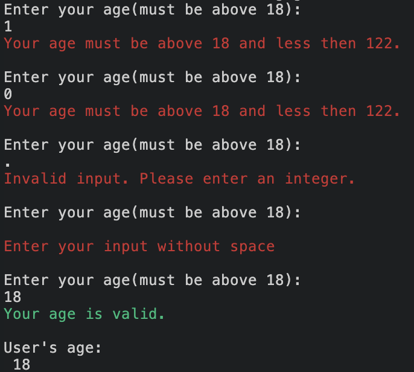
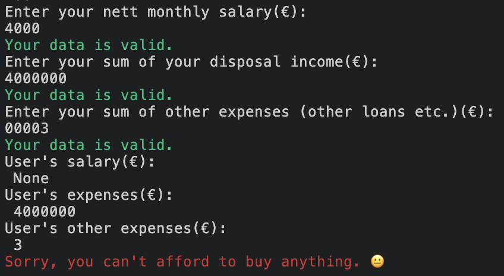

# Mortgage Calculator

This is a mortgage calculator that estimates the amount of money you can afford to spend or borrow as a loan. 

*Please note that these calculations are simplified and a real mortgage calculator would need to consider additional factors, such as taxes and fees.

Here you can view the project. [LINK](https://ninaschulte-mortgagecalculator-4bb5d57d1e7f.herokuapp.com/)
## User stories
| ID | User Stories |
|----|--------------|
| 1  | As a user, I want to see a welcome message so that I know the purpose of this program. |
| 2  | As a user, I want to see rules, so that I can decide whether to continue with my calculations. |
| 3  | As a user, I want to see where I can start with my mortgage calculator. |
| 4  | As a user, I want to see an error message when my input is incorrect. |
| 5  | As a user, I want to see a success message when my data is valid. |
| 6  | As a user, I want to see final calculations so that I understand how much money I can invest. |
## Flowchart
The flowchart represents the logic of the application:

## Features
### Welcome message
Welcome message with some basic rules, what kind of data will be only accepted for further calculations.

### Age input and Age retirement input
Calculator ask users to add age and retirement age

### Salary, expenses and other expenses input
Calculator ask users for three additional inputs: salary, expenses and other expenses input.

### Outcome result
Calculator return to the user sum
## Technologies Used
### Languages:
- Python: serves as the project's foundation, guiding and shaping all aspects of the application's behavior.

- JavaScript: contributes the essential start script, enabling the execution of the Code Institute's mock terminal within the browser environment.

- HTML: employed in crafting the fundamental elements integral to constructing the simulated terminal experience within the browser.
## Frameworks/Libraries, Programmes and Tools
### Python modules/packages:
#### Standard library imports:
[os](https://docs.python.org/3/library/os.html) module for various operating system-related tasks.
#### Third-party imports:
- [Colorama](https://pypi.org/project/colorama/) used to add colors and styles to the project.
- [Simple Menu](https://pypi.org/project/simple-term-menu/) was used to implement the menu.
Other tools:
- [Codeanywhere]([https://pypi.org/project/colorama/](https://dashboard.codeanywhere.com/)) was used to edit code.
- [Git](https://git-scm.com/download/mac)Git was used to version control of the website.
- [Github]([https://pypi.org/project/colorama/](https://github.com/))Github was used to host the code of the website
- [Heroku]([[https://pypi.org/project/colorama/](https://dashboard.codeanywhere.com/)](https://devcenter.heroku.com/articles/getting-started-with-python#set-up))Heroku was used to deploy the project
## Bugs
### Solved
#### Validate data on money input fields
1. I have a code with three money inputs that need to be validated. In my first version of the code, I attempted to validate all three inputs through one while loop. The issue here was that the error messages didn't appear, and in case of an error, the terminal just displayed the same question again.
```python
def get_money_info():
    """
    Function that will get user input on salary, expenses, and other expenses.
    Function also validate user input data based on space around and special characters.
    """
    salary, expense, other_expense = None, None, None
    
    while salary is None or expense is None or other_expense is None:
        user_input = input("Enter your input:")

        if user_input.strip() != user_input:
            print("Enter your input without space")
            continue

        try:
            value = int(user_input.strip())
            if salary is None:
                salary = value
            elif expense is None:
                expense = value
            elif other_expense is None:
                other_expense = value
            else:
                break
        except ValueError:
            print("Invalid input. Please enter an integer.")

    print("All your data is valid.")
    return salary, expense, other_expense

```
2. Then I started to think about how to solve this, and I created three separate while loops within a single function. This resolved the problem of error messages not displaying. However, according to the best practices that I learned at Code Institute, this wasn't the optimal approach, as it's recommended to have small functions.
```python
def get_money_info():
    """
    Function that will get user input on salary, expenses, and other expenses.
    Function also validate user input data based on space around and special characters.
    """
    while True:
        salary_input = input("Enter your nett monthly salary:")
        salary_input_stripped = salary_input.strip()

        if salary_input_stripped != salary_input:
            print("Enter your input without space")
            continue

        try:
            salary = int(salary_input_stripped)
            break  
        except ValueError:
            print("Invalid input. Please enter an integer.")
            
    while True:
        expense_input = input("Enter your sum of your food, leisure expenses per month:")
        expense_input_stripped = expense_input.strip()

        if expense_input_stripped != expense_input:
            print("Enter your input without space")
            continue

        try:
            expense = int(expense_input_stripped)
            break  
        except ValueError:
            print("Invalid input. Please enter an integer.")

    while True:
        other_expense_input = input("Enter your sum of other expenses (other loans etc.):")
        other_expense_input_stripped = other_expense_input.strip()

        if other_expense_input_stripped != other_expense_input:
            print("Enter your input without space")
            continue

        try:
            other_expense = int(other_expense_input_stripped)
            break  
        except ValueError:
            print("Invalid input. Please enter an integer.")

    print("All your data is valid.")
    return salary, expense, other_expense
```
3. After that I was trying out different approaches how to make this code shorter and also readable and I created two different functions out of it. 
```python
def validate_user_input(message):
    """Function to validate user data."""
    while True:
        user_input = input(message)
        user_stripped = user_input.strip()

        if user_stripped != user_input:
            print_error("Enter your input without space\n")
            continue

        try:
            data = int(user_stripped)
            print_success("Your data is valid.")
            return data
        except ValueError:
            print_error("Invalid input. Please enter an integer.\n")


def get_money_info():
    """
    Function to get the user input.
    After that data is validated with the validate_user_input function.
    """
    salary = validate_user_input("Enter your nett monthly salary(€):\n")
    expense = validate_user_input("Enter your sum of your disposal income(€):\n")
    other_expense = validate_user_input("Enter your sum of other expenses (other loans etc.)(€):\n")

    if expense + other_expense > salary:
        return None, expense, other_expense

    return salary, expense, other_expense
```
## Testing
## Deployment 
- The program was deployed to [Heroku]([[https://pypi.org/project/colorama/](https://dashboard.codeanywhere.com/)](https://devcenter.heroku.com/articles/getting-started-with-python#set-up)).
- The program can be reached by the [link](https://ninaschulte-mortgagecalculator-4bb5d57d1e7f.herokuapp.com/)
### To deploy the project as an application that can be run locally:


## Credits
- For colours in terminal, I used [colorama]([https://pypi.org/project/colorama/](https://www.programcreek.com/python/?CodeExample=print+success)https://www.programcreek.com/python/?CodeExample=print+success) and [blessed](https://pypi.org/project/blessed/)
- For validating sections I found the following material: [Python tutorials on Errors](https://docs.python.org/3/tutorial/errors.html), [Youtube totorial]([[https://pypi.org/project/colorama/](https://www.programcreek.com/python/?CodeExample=print+success)https://www.programcreek.com/python/?CodeExample=print+success](https://www.youtube.com/watch?v=LUWyA3m_-r0&t=644s)https://www.youtube.com/watch?v=LUWyA3m_-r0&t=644s)
- typewrite style https://www.youtube.com/watch?v=2h8e0tXHfk0
### Acknowledgements
I am truly grateful for the unwavering support and valuable feedback provided by my mentor [Julia Konovalova](https://github.com/IuliiaKonovalova)throughout my journey. Julia Konovalova guidance has been instrumental in shaping my growth and progress.
