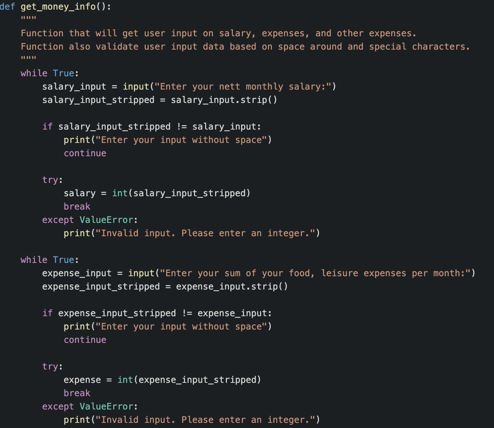
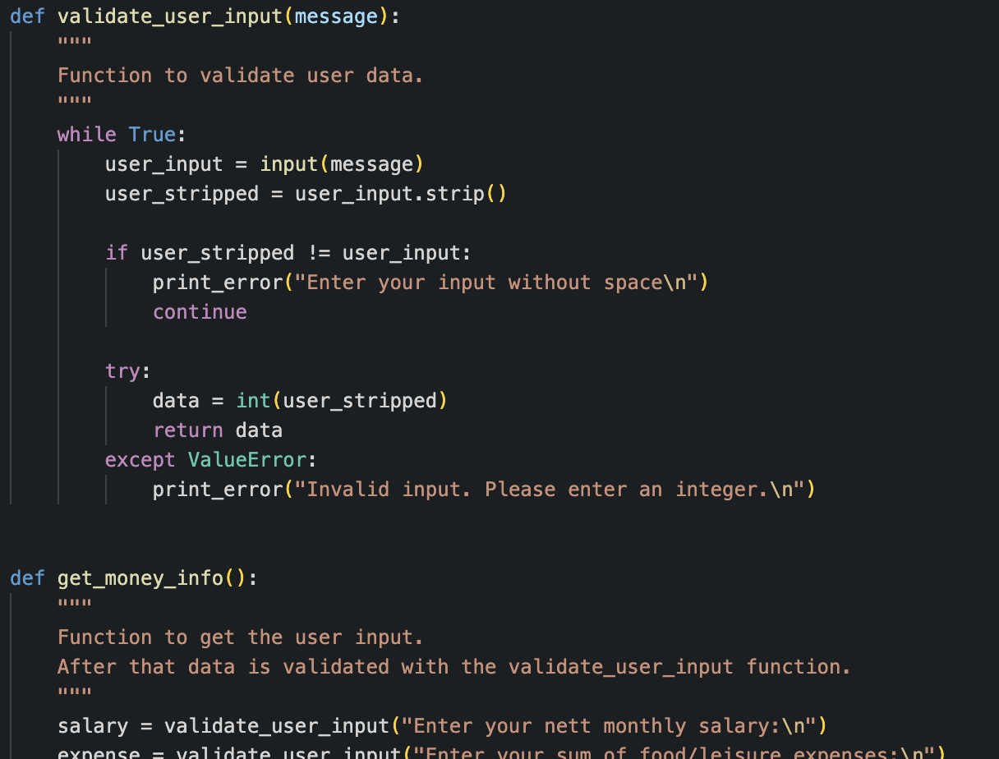

# Mortgage Calculator

This is a mortgage calculator that estimates the amount of money you can afford to spend or borrow as a loan. Please note that these calculations are simplified and a real mortgage calculator would need to consider additional factors, such as taxes and fees.

Link to the Heroku deployed app: [https://ninaschulte-mortgagecalculator-4bb5d57d1e7f.herokuapp.com/](https://ninaschulte-mortgagecalculator-4bb5d57d1e7f.herokuapp.com/)

## Features
### Welcome message
Welcome message with some basic rules, what kind of data will be only accepted for further calculations.
### Age input and Age retirement input
Calculator ask users to add age and retirement age
### Salary, expenses and other expenses input
Calculator ask users for three additional inputs: salary, expenses and other expenses input.
### Outcome result
Calculator return to the user sum

## Test
### PEP3 validator
### Manual testing

## Bugs
### Validate data on money input fields
I have a code with three money inputs that need to be validated. In my first version of the code, I attempted to validate all three inputs through one while loop. The issue here was that the error messages didn't appear, and in case of an error, the terminal just displayed the same question again. 
Then I started to think about how to solve this, and I created three separate while loops within a single function. This resolved the problem of error messages not displaying. However, according to the best practices that I learned at Code Institute, this wasn't the optimal approach, as it's recommended to have small functions. 
After that I was trying out different approaches how to make this code shorter and also readable and I created two different functions out of it. 

## Credits
- For colours in terminal, I used [colorama]([https://pypi.org/project/colorama/](https://www.programcreek.com/python/?CodeExample=print+success)https://www.programcreek.com/python/?CodeExample=print+success) and [blessed](https://pypi.org/project/blessed/)
- For validating sections I found the following material: [Python tutorials on Errors](https://docs.python.org/3/tutorial/errors.html), [Youtube totorial]([[https://pypi.org/project/colorama/](https://www.programcreek.com/python/?CodeExample=print+success)https://www.programcreek.com/python/?CodeExample=print+success](https://www.youtube.com/watch?v=LUWyA3m_-r0&t=644s)https://www.youtube.com/watch?v=LUWyA3m_-r0&t=644s)
- typewrite style https://www.youtube.com/watch?v=2h8e0tXHfk0
