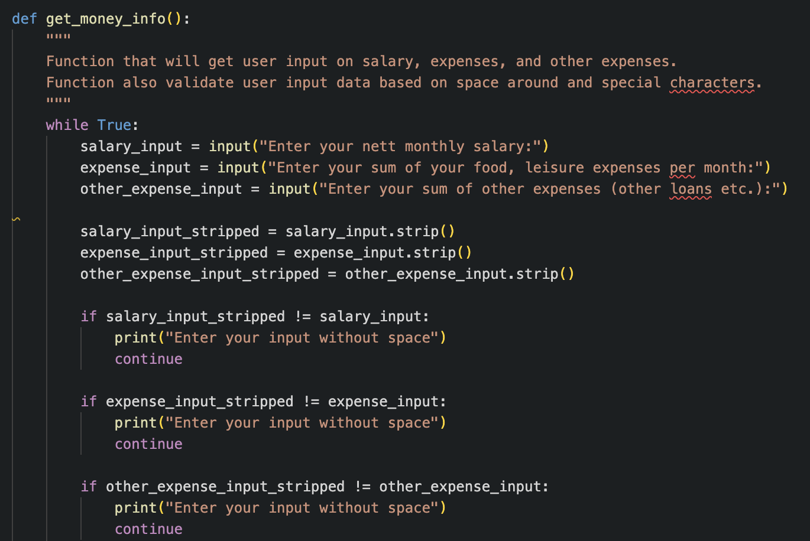

# Mortgage Calculator

This is a mortgage calculator that estimates the amount of money you can afford to spend or borrow as a loan. Please note that these calculations are simplified and a real mortgage calculator would need to consider additional factors, such as taxes and fees.

Link to the Heroku deployed app: [https://ninaschulte-mortgagecalculator-4bb5d57d1e7f.herokuapp.com/](https://ninaschulte-mortgagecalculator-4bb5d57d1e7f.herokuapp.com/)

## Features
### Welcome message
Welcome message with some basic rules, what kind of data will be only accepted for further calculations.
### Age input and Age retirement input
Calculator ask users to add age and retirement age
### Salary, expenses and other expenses input
Calculator ask users for three additional inputs: salary, expenses and other expenses input.
### Outcome result
Calculator return to the user sum

## Test

## Bugs
### Validate data on money input fields
I have in the code three money inputs that needs to be validated. And in my first version of the code I validated all three inputs through one while loop. The problem here was that the error messages didn´t appear and in case of the error, terminal just display again this question. 
Then I started to think further how to solve this and I created three seperate while loops in one function. This solved the problem of error message displaying. But according to the best practises that I learned on Code Institute this was not the best because the best is to have a small function. 
After that I reasearched on the internet how to solve this problem and I found some (credits stated in the credit section) solutions. And here is the end result of refactoring the code to the final stage. 

