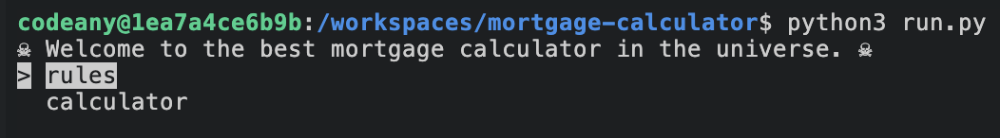
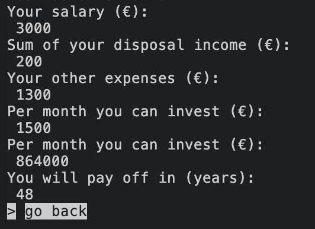
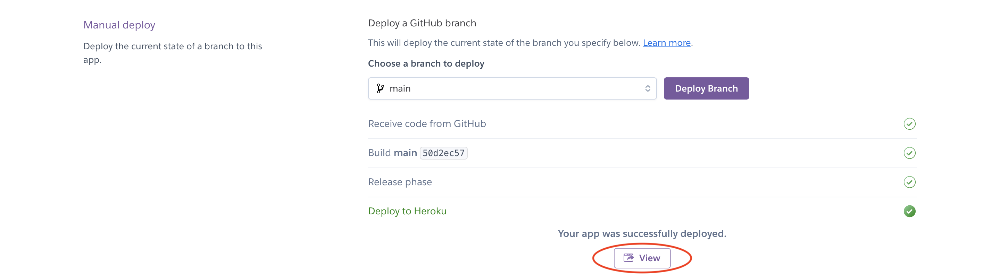

# Mortgage Calculator

This is a mortgage calculator that estimates the amount of money you can afford to spend or borrow as a loan. 

*Please note that these calculations are simplified and a real mortgage calculator would need to consider additional factors, such as taxes and fees.

Here you can view the project. [LINK](https://ninaschulte-mortgagecalculator-4bb5d57d1e7f.herokuapp.com/)
## User stories
| ID | User Stories |
|----|--------------|
| 1 | As a user, I wish to view a welcome message to understand the purpose of this program. |
| 2 | As a user, I desire to access rules to make an informed decision about proceeding with my calculations. |
| 3 | As a user, I aim to find a clear starting point for utilizing the mortgage calculator. |
| 4 | As a user, I expect to receive an error message when my input contains mistakes. |
| 5 | As a user, I anticipate receiving a success message when my entered data is valid. |
| 6 | As a user, I would like to see final calculations in order to comprehend the potential investment amount. |
## Flowchart
The flowchart represents the logic of the application:

## Features
### Welcome message
A welcome message displays basic rules regarding the accepted data for further calculations.

### Rules
An explanation to the user about the purpose of the program and a set of accompanying rules.

### Go back button
A "Go back" button is provided on both the rules screen and upon completing the calculator. This button returns the user to the initial page, where they can choose between rules and the calculator.
### Age input and Age retirement input
The calculator prompts users to enter their current age and retirement age.

### Salary, expenses and other expenses input
The calculator also prompts users for three additional inputs: salary, regular expenses, and other expenses. If the total expenses exceed the user's salary, the program returns an error indicating that the user cannot afford to buy a property.

### Result
Upon successful validation of the input data, the program presents the user with a results page displaying three calculated values:

- The monthly amount available for investment.
- The total investment amount over the years (calculated as user's salary minus the sum of all expenses).
- The number of years required to pay off this investment (calculated as (retirement age - user age) * 12) * monthly amount.
  

## Technologies Used
### Languages:
- Python: serves as the project's foundation, guiding and shaping all aspects of the application's behavior.

- JavaScript: contributes the essential start script, enabling the execution of the Code Institute's mock terminal within the browser environment.

- HTML: employed in crafting the fundamental elements integral to constructing the simulated terminal experience within the browser.
## Frameworks/Libraries, Programmes and Tools
### Python modules/packages:
#### Standard library imports:
- [os](https://docs.python.org/3/library/os.html) module for various operating system-related tasks.
- [time](https://docs.python.org/3/library/time.html) this module provides various time-related functions.
- [sys](https://docs.python.org/3/library/sys.html) this module provides access to some variables used or maintained by the interpreter and to functions that interact strongly with the interpreter.
#### Third-party imports:
- [Colorama](https://pypi.org/project/colorama/) was used to add colors and styles to the project.
- [Simple Menu](https://pypi.org/project/simple-term-menu/) was used to implement the menu.
- [Emoji](https://pypi.org/project/emoji/) was used for emojis.
#### Other tools:
- [Codeanywhere](https://dashboard.codeanywhere.com/) was used to edit code.
- [GitHub](https://github.com/) was used to host the website's code.
- [Heroku](https://devcenter.heroku.com/articles/getting-started-with-python#set-up) was used to deploy the project.
## Testing
### PEP3
### Bugs
#### Validate data on money input fields
1. I have a code with three money inputs that need to be validated. In my first version of the code, I attempted to validate all three inputs through one while loop. The issue here was that the error messages didn't appear, and in case of an error, the terminal just displayed the same question again.
```python
def get_money_info():
    """
    Function that will get user input on salary, expenses, and other expenses.
    Function also validate user input data based on space around and special characters.
    """
    salary, expense, other_expense = None, None, None
    
    while salary is None or expense is None or other_expense is None:
        user_input = input("Enter your input:")

        if user_input.strip() != user_input:
            print("Enter your input without space")
            continue

        try:
            value = int(user_input.strip())
            if salary is None:
                salary = value
            elif expense is None:
                expense = value
            elif other_expense is None:
                other_expense = value
            else:
                break
        except ValueError:
            print("Invalid input. Please enter an integer.")

    print("All your data is valid.")
    return salary, expense, other_expense

```
2. Then I created three separate while loops within a single function. This resolved the problem of error messages not displaying. However, according to the best practices that I learned at Code Institute, this wasn't the optimal approach, as it's recommended to have small functions.
```python
def get_money_info():
    """
    Function that will get user input on salary, expenses, and other expenses.
    Function also validate user input data based on space around and special characters.
    """
    while True:
        salary_input = input("Enter your nett monthly salary:")
        salary_input_stripped = salary_input.strip()

        if salary_input_stripped != salary_input:
            print("Enter your input without space")
            continue

        try:
            salary = int(salary_input_stripped)
            break  
        except ValueError:
            print("Invalid input. Please enter an integer.")
            
    while True:
        expense_input = input("Enter your sum of your food, leisure expenses per month:")
        expense_input_stripped = expense_input.strip()

        if expense_input_stripped != expense_input:
            print("Enter your input without space")
            continue

        try:
            expense = int(expense_input_stripped)
            break  
        except ValueError:
            print("Invalid input. Please enter an integer.")

    while True:
        other_expense_input = input("Enter your sum of other expenses (other loans etc.):")
        other_expense_input_stripped = other_expense_input.strip()

        if other_expense_input_stripped != other_expense_input:
            print("Enter your input without space")
            continue

        try:
            other_expense = int(other_expense_input_stripped)
            break  
        except ValueError:
            print("Invalid input. Please enter an integer.")

    print("All your data is valid.")
    return salary, expense, other_expense
```
3. After that I was trying out different approaches how to make this code shorter and also readable and I created two different functions out of it. 
```python
def validate_user_input(message):
    """Function to validate user data."""
    while True:
        user_input = input(message)
        user_stripped = user_input.strip()

        if user_stripped != user_input:
            print_error("Enter your input without space\n")
            continue

        try:
            data = int(user_stripped)
            print_success("Your data is valid.")
            return data
        except ValueError:
            print_error("Invalid input. Please enter an integer.\n")


def get_money_info():
    """
    Function to get the user input.
    After that data is validated with the validate_user_input function.
    """
    salary = validate_user_input("Enter your nett monthly salary(€):\n")
    expense = validate_user_input("Enter your sum of your disposal income(€):\n")
    other_expense = validate_user_input("Enter your sum of other expenses (other loans etc.)(€):\n")

    if expense + other_expense > salary:
        return None, expense, other_expense

    return salary, expense, other_expense
```
## Deployment 
- The program was deployed to [Heroku]([[https://pypi.org/project/colorama/](https://dashboard.codeanywhere.com/)](https://devcenter.heroku.com/articles/getting-started-with-python#set-up)).
- The program can be reached by the [link](https://ninaschulte-mortgagecalculator-4bb5d57d1e7f.herokuapp.com/)
### Steps launch the application
1. In Codeanywhere, create a list of requirements.txt that project needs to run (all the imports). Run command "Pip3 freeze > requirements.txt". 
2. Save changes and with command git push, push the files to your repository.
3. Create a [Heroku](https://dashboard.heroku.com/account) account.
4. Create a new Heroku application on the following page [Heroku - new app](https://dashboard.heroku.com/apps):
   
5. Tap on deploy:
   
6. Link your GitHub account and connect the application to the repository:
   
7. Tap on Setting:
   
8. Click on "Add buildpack":
   
9. Click on "Reveal Config Vars":
   
10. Add 1 new config vars:
    - Key: PORT Value: 8000
    - Provided by [Code Institute](https://codeinstitute.net/de/)
11. Go back to Deploy tab:
    
12. Click on "Deploy Branch:
    
13. Wait for the completion:
    
14. Click on "View" to launch the application inside a web page:
    
## Credits
- For colors in the terminal, I used [colorama](https://pypi.org/project/colorama/).
- For validating [Python tutorials on Errors](https://docs.python.org/3/tutorial/errors.html) and a helpful [YouTube tutorial](https://www.youtube.com/watch?v=LUWyA3m_-r0&t=644s).
- Typewrite style is covered in this [YouTube tutorial](https://www.youtube.com/watch?v=2h8e0tXHfk0).
- If statements are explained in the [Python tutorial on if statements](https://docs.python.org/3/tutorial/controlflow.html#if-statements).
- For space validation, you can refer to the [Python tutorial on strip()](https://docs.python.org/3/library/stdtypes.html#str.strip).
- For many small details, I used also [Python W3Schools resource](https://www.w3schools.com/python/).
### Acknowledgements
- I am truly grateful for the unwavering support and valuable feedback provided by my mentor [Julia Konovalova](https://github.com/IuliiaKonovalova) throughout my journey. Julia Konovalova guidance has been instrumental in shaping my growth and progress.
